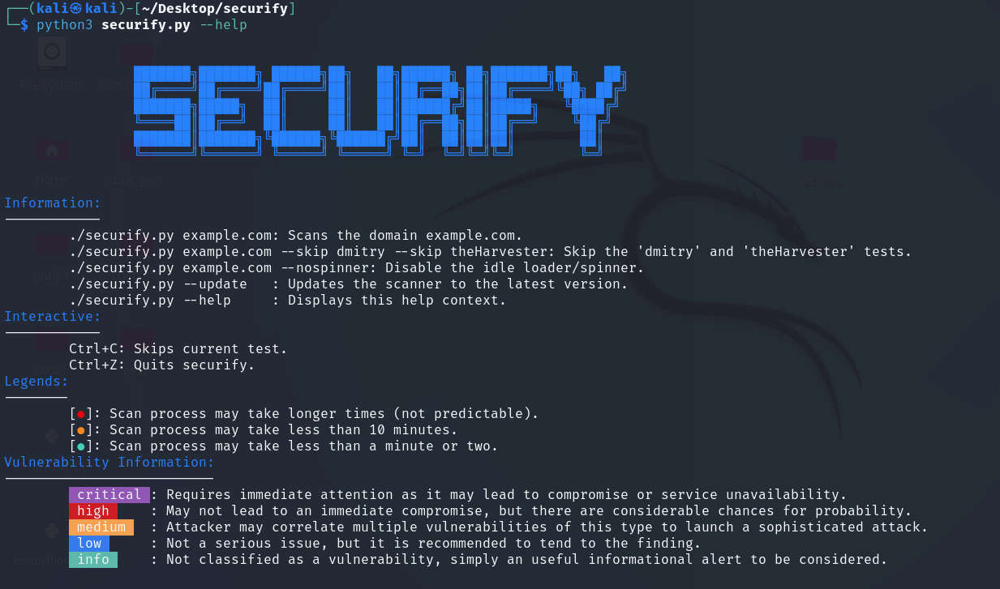

<h1>🚀 Securify – A Comprehensive Cybersecurity Tool 🚀</h1>

Welcome to <strong>Securify</strong>, a project I developed as part of my academic work. Securify is designed to enhance system security through rigorous testing and detailed reporting. Here's a closer look at what Securify offers:

<h2>🔒 Key Features:</h2>

<ul>
  <li><strong>Tool Verification Phase:</strong> Automatically checks the availability of essential tools before analysis begins.</li>
  <li><strong>Vulnerability Testing:</strong> Executes 60 validated tests to identify and assess known vulnerabilities, providing a thorough security evaluation.</li>
  <li><strong>Vulnerability Detection & Reporting:</strong> Generates detailed reports for each detected vulnerability, with severity assessments and actionable remediation steps.</li>
  <li><strong>Test Results Overview:</strong> Displays a summary of the tests, including the number of vulnerabilities found and the time remaining for the analysis.</li>
  <li><strong>Detailed Reports:</strong> Securify generates two comprehensive reports:
    <ul>
      <li>A list of all commands executed.</li>
      <li>A focused report on commands that detected vulnerabilities, offering transparency and ease of review.</li>
    </ul>
  </li>
  <li><strong>Intuitive Dashboard:</strong> The web-based dashboard (built using HTML and Jinja2) provides clear visual summaries through bar charts and graphs, making results accessible to all users.</li>
</ul>

I’m proud of the progress made with Securify and believe it’s a step toward more accessible and effective cybersecurity.

Let’s make the digital world safer! 🌐

